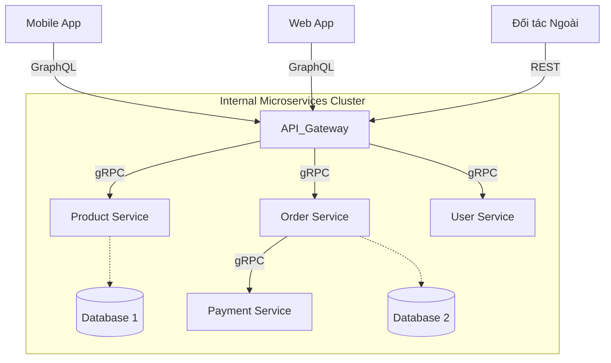

# Bài 3: So Sánh REST, gRPC và GraphQL

Bài làm này tập trung vào việc so sánh và phân tích tính ứng dụng thực tế của ba chuẩn giao tiếp phổ biến hiện nay: **REST**, **gRPC**, và **GraphQL**, thay vì chỉ liệt kê lý thuyết đơn thuần.

## 1. Phân Tích Bối Cảnh (Ví dụ Thực Tế: Hệ Thống E-commerce)

Để minh họa sự khác biệt, ta xét một hệ thống **Thương mại điện tử (E-commerce)** gồm nhiều thành phần:

- **Public API**: Nơi các đối tác (bán hàng, vận chuyển) truy cập để lấy danh sách sản phẩm.
  - **Lựa chọn:** `REST`.
  - **Lý do:** Chuẩn hóa, dễ tích hợp cho bất kỳ bên thứ 3 nào mà không cần cài đặt thư viện đặc thù.
- **Giao tiếp nội bộ (Internal Servies)**: Service "Đặt hàng" (Order Service) cần gọi sang Service "Thanh toán" (Payment Service) để trừ tiền.
  - **Lựa chọn:** `gRPC`.
  - **Lý do:** Cần tốc độ cực nhanh, độ trễ thấp (low latency) và định kiểu dữ liệu chặt chẽ để tránh lỗi giao dịch.
- **Mobile App**: Ứng dụng trên điện thoại hiển thị trang chủ gồm: Thông tin User, Lịch sử đơn hàng, và Gợi ý sản phẩm (3 nguồn dữ liệu khác nhau).
  - **Lựa chọn:** `GraphQL`.
  - **Lý do:** Chỉ cần 1 request để lấy đủ 3 loại dữ liệu trên, tránh việc điện thoại phải gọi 3 API REST khác nhau (tiết kiệm pin và data 4G).

## 2. Bảng So Sánh Kỹ Thuật

| Đặc điểm              | REST                                         | gRPC                                                    | GraphQL                                                 |
| :-------------------- | :------------------------------------------- | :------------------------------------------------------ | :------------------------------------------------------ |
| **Triết lý**          | Dựa trên tài nguyên (Resources/URLs)         | Dựa trên hành động (Functions/Procedures)               | Dựa trên truy vấn (Query-based)                         |
| **Định dạng dữ liệu** | JSON (văn bản, dễ đọc)                       | Protobuf (nhị phân, máy đọc nhanh, nhẹ)                 | JSON                                                    |
| **Giao thức**         | HTTP/1.1 (thường dùng)                       | HTTP/2 (mặc định)                                       | HTTP (thường dùng)                                      |
| **Ưu điểm**           | Dễ học, phổ biến, Cache tốt (CDN/Browser)    | Hiệu suất cực cao, tiết kiệm băng thông, Strongly-typed | Tránh việc lấy thừa/thiếu dữ liệu (Over/Under-fetching) |
| **Nhược điểm**        | Lấy thừa/thiếu dữ liệu, payload văn bản nặng | Khó debug (do binary), yêu cầu cài đặt phía Client      | Phức tạp khi triển khai phía Server, khó Caching        |

## 3. Phân Tích Hiệu Suất & Ứng Dụng ("Cái nào chạy tốt khi nào?")

Đây là phần quan trọng để quyết định công nghệ cho dự án:

### a. Dùng REST khi:

- **Xây dựng Public API:** Muốn ai cũng có thể gọi được API của bạn mà không cần tool chuyên dụng.
- **Cần Caching mạnh mẽ:** Tận dụng khả năng cache của HTTP (như 304 Not Modified) tại Browser hoặc CDN.
- **Quản lý tài nguyên đơn giản:** Hệ thống thiên về CRUD (Create, Read, Update, Delete) trên các đối tượng rõ ràng (User, Product).

### b. Dùng gRPC khi:

- **Giao tiếp giữa các Microservices (Backend-to-Backend):** Nơi độ trễ (latency) tính bằng mi-li-giây là sống còn.
- **Hệ thống đa ngôn ngữ:** Ví dụ Service A viết bằng Java gọi Service B viết bằng Python. Protobuf giúp sinh code tự động cho cả 2 ngôn ngữ, đảm bảo không sai lệch kiểu dữ liệu.
- **Streaming:** Cần truyền dữ liệu 2 chiều liên tục (như chat, voice call).

### c. Dùng GraphQL khi:

- **Tối ưu cho Frontend (Mobile/Web):** Thiết bị yếu, mạng kém (3G/4G). Client cần quyền linh hoạt: _"Tôi chỉ muốn lấy Tên và Giá của sản phẩm, đừng trả về cả bài mô tả dài 1000 dòng"_.
- **Dữ liệu dạng đồ thị/quan hệ phức tạp:** Ví dụ lấy `User` -> ra `Posts` của User đó -> ra `Comments` trong Post. REST sẽ cần gọi dây chuyền nhiều API, GraphQL chỉ cần 1 query lồng nhau.

## 4. Mô Hình Kiến Trúc Dự Án Đề Xuất

Dưới đây là sơ đồ kết hợp cả 3 công nghệ trong một hệ thống lớn:



### Giải thích sơ đồ:

1.  **Frontend (Mobile/Web) gọi GraphQL**: Để lấy đúng dữ liệu hiển thị, giảm số lượng request.
2.  **API Gateway**: Đứng giữa chuyển đổi. Nó nhận GraphQL query hoặc REST request, sau đó gọi xuống các services bên dưới.
3.  **Internal Services gọi gRPC**: Bên trong "vùng an toàn" (Server-side), các service gọi nhau bằng gRPC để đạt tốc độ cao nhất.

## 5. Hướng Dẫn Chạy Demo Code

Dưới đây là hướng dẫn chạy 3 ví dụ minh họa (Code nằm trong thư mục `code/`):

### Demo 1: REST API (Cổng 3000)

Mô phỏng 1 service trả về danh sách sản phẩm dạng JSON.

1.  Mở terminal tại `bai3/code/rest-api`
2.  Chạy:
    ```bash
    npm install
    npm start
    ```
3.  Test: Mở trình duyệt `http://localhost:3000/products`

### Demo 2: gRPC Service (Cổng 50051)

Mô phỏng quy trình Client gọi Server bằng hàm (Function Call) qua giao thức binary.

1.  Mở terminal tại `bai3/code/grpc-service`
2.  Chạy Server: `npm start`
3.  Mở terminal khác, chạy Client để gọi: `npm run client`
    - Bạn sẽ thấy Client gọi hàm `GetProduct({id: 1})` và nhận về kết quả từ Server.

### Demo 3: GraphQL API (Cổng 4000)

Mô phỏng việc Client được phép chọn trường dữ liệu mình muốn.

1.  Mở terminal tại `bai3/code/graphql-api`
2.  Chạy: `npm start`
3.  Mở trình duyệt `http://localhost:4000` (Apollo Sandbox)
4.  Điền query sau để test tính năng "chỉ lấy tên và giá" (không lấy description):
    ```graphql
    query {
      product(id: "1") {
        name
        price
      }
    }
    ```
